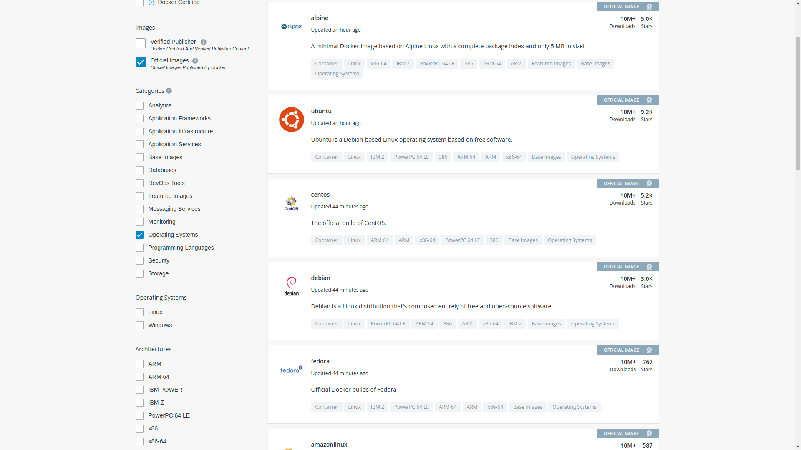
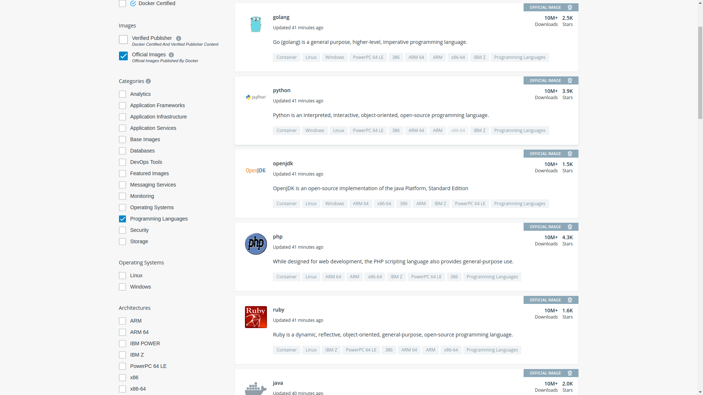
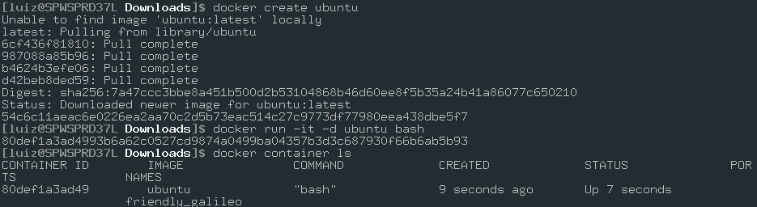
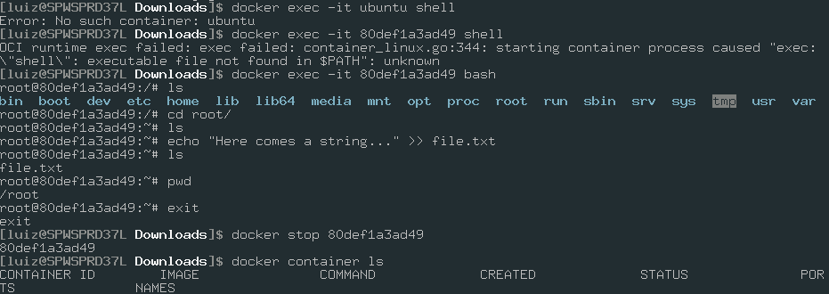
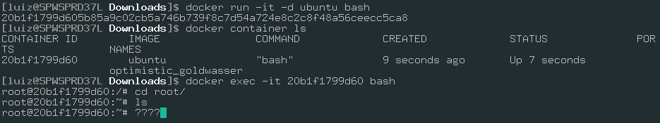
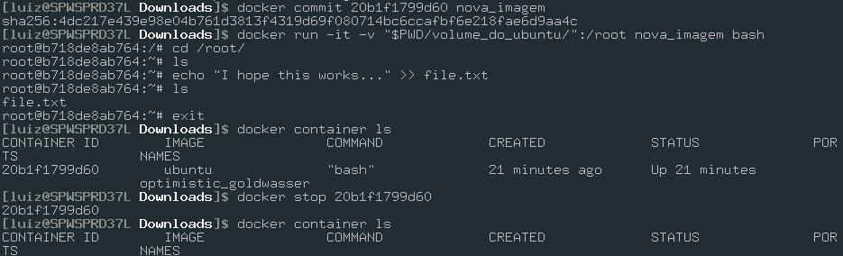
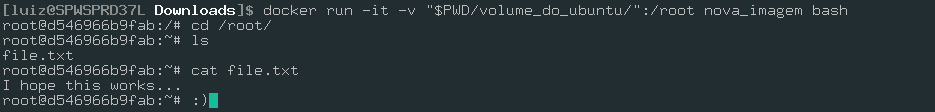
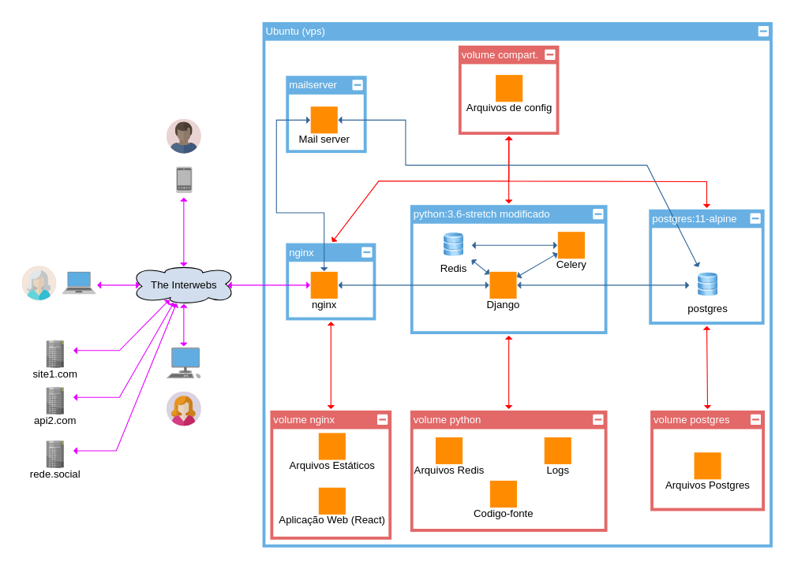
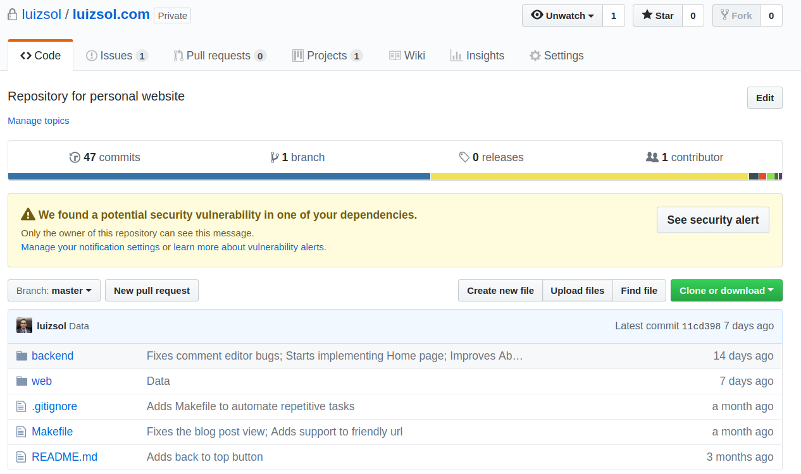

# O problema

A pessoa $A$ desenvolveu um *pipeline* de [*Machile Learning*](https://pt.wikipedia.org/wiki/Aprendizado_de_m%C3%A1quina) em [*Python*](https://www.python.org/) no seu computador pessoal.

---

O *setup* da pessoa $A$ é:

* [*Majaro*](https://manjaro.org/) 17.1 (Arch Linux)
* [*Python*](https://www.python.org/) 3.5

* [*PostgreSQL*](https://www.postgresql.org/) 10.3 (Banco de Dados)
* [*PyTorch*](https://pytorch.org/) 0.9
* [*Pandas*](https://pandas.pydata.org/) 0.14

---

Agora a pessoa $B$ precisa revisar o código (ver se foi bem escrito e se funciona corretamente).

---

O *setup* da pessoa $B$ é:

* [*Windows*](https://www.microsoft.com/pt-br/windows) 10
* [*Python*](https://www.python.org/) 3.7
* [*MySQL*](https://www.mysql.com/) 5.7 (Banco de Dados)
* [*TensorFlow*](https://www.tensorflow.org/) 0.9
* [*Pandas*](https://pandas.pydata.org/) 0.21

---

E uma vez que o código for aprovado ele deverá ser colocado no servidor de produção $C$ (máquina que irá rodar de fato a aplicação).

---

O *setup* do servidor $C$ é:

* [*RHEL*](https://www.redhat.com/pt-br) 7.6 (Red Hat Linux)
* [*Python*](https://www.python.org/) 3.6
* [*Cassandra*](http://cassandra.apache.org/) 3.11 (Banco de Dados)
* [*TensorFlow*](https://www.tensorflow.org/) 0.7
* [*Pandas*](https://pandas.pydata.org/) 0.26

---

O Pesquisador $D$ está tentando comparar a diferença de performance entre duas versões diferentes da [*JVM*](https://pt.wikipedia.org/wiki/M%C3%A1quina_virtual_Java) ([*Java*](https://www.java.com/pt_BR/)), mas não quer ter que desinstalar e instalar cada versão para cada teste que precisar realizar.

---

E agora José?

---

Temos um problema de reproducibilidade e isolamento de ambientes de execução.

# Possíveis soluções:

* **Solução 1**: Obrigar todos a utilizarem os mesmos softwares que estão no servidor de produção
* **Problemas da solução 1**:
  * Servidores tendem a utilizar versões antigas e estáveis de software, o que pode atrapalhar os pesquisadores
  * Nem sempre é possível usar para desenvolvimento o que se usa em produção (licenças, interface com o usuário, demanda computacional etc)
  * Restringir pesquisadores e desenvolvedores pode resultar na fuga de capital humano qualificado

---

* **Solução 2**: Utilizar *máquinas* virtuais que espelhem o setup de produção
* **Problemas da solução 2**:
  * Máquinas virtuais são grandes (~10GB) e consomem bastante memória (~6GB) por si só
  * Versionamento (controle de versões) de máquinas virtuais não é uma tarefa simples (arquivos binários)
  * A interação entre a máquina hopedeira e a máquina hóspede (máquina virtualizada) nem sempre é simples (arquivos, rede, *clipboard* etc)

# [**Docker**](https://www.docker.com/) ao resgate

O [*Docker*](https://www.docker.com/) tenta solucionar este problema criando "máquinas virtuais" compactas, flexíveis e reutilizáveis.

---

O [*Docker*](https://www.docker.com/) utiliza o próprio [*kernel*](https://pt.wikipedia.org/wiki/N%C3%BAcleo_(sistema_operacional)) (a "base") do sistema operacional para executar as aplicações das máquinas virtualizadas.


---

Os pricipais conceitos do [*Docker*](https://www.docker.com/) são:

* [**Imagens**](https://docs.docker.com/engine/reference/commandline/images/): instruções de como construir os containers
* [***Containers***](https://www.docker.com/resources/what-container): as "máquinas virtuais" já construídas a partir dos containers
* [**Volumes**](https://docs.docker.com/storage/volumes/): pastas no computador hospedeiro que o container irá utilizar para armazenar arquivos permanentemente
* [**Redes**](https://docs.docker.com/v17.09/engine/userguide/networking/): as sub-redes das quais os containers farão parte

---

# [Imagens](https://docs.docker.com/engine/reference/commandline/images/)

São as "plantas" que serão utilizadas para construir os *containers*

---

São contruídas a partir de outras imagens que estão disponíveis no repositório público do Docker (entitulado [Docker Hub](http://hub.docker.com))

---

## Imagens de sistemas operacionais "puros"



---

## Imagens de sistemas operacionais com linguagens pré-instaladas



---

## Imagens de sistemas operacionais com bancos de dados pré-instalados


---

Ex: Se eu quiser construir uma imagem para um continer [*Linux*](https://pt.wikipedia.org/wiki/Linux) que irá fazer [*web scrapping*](https://en.wikipedia.org/wiki/Web_scraping) utilizando [*Celery*](http://www.celeryproject.org/) eu posso criar a imagem:

* A partir da imagem de um [*Linux*](https://pt.wikipedia.org/wiki/Linux) puro ([*Alpine*](https://alpinelinux.org/), [*Ubuntu*](https://www.ubuntu.com/) etc)
* A partir da imagem oficial do [*Python*](https://www.python.org/) (que por sua vez foi criada a partir da imagem de um [*Linux*](https://pt.wikipedia.org/wiki/Linux) puro)
* A partir de uma imagem que já tenha [*Celery*](http://www.celeryproject.org/) instalado e configurado

---

Trechos do [`Dockerfile`](https://docs.docker.com/engine/reference/builder/) do [*MySQL*](https://www.mysql.com/)

---

```bash
# Usando outra imagem como ponto de partida
FROM debian:stretch-slim # ...
# Executando comandos para instalar pacotes
RUN apt-get update && # ...
# Definindo variáveis de ambiente
ENV GOSU_VERSION 1.7 # ...
# Expondo uma das pastas para o hospedeiro
VOLUME /var/lib/mysql # ...
# Copiando arquivos para a imagem
COPY config/ /etc/mysql/ # ...
# Expondo a porta 3306 para o hospedeiro
EXPOSE 3306 33060 # ...
# Executando o deamon do MySQL
CMD ["mysqld"]
```

Fonte: [MySQL Docker File](https://github.com/docker-library/mysql/blob/a7a737f1eb44db467c85c8229df9d886dd63460e/8.0/Dockerfile)

---

Esses comandos serão executados toda vez que um novo container de [*MySQL*](https://www.mysql.com/) for construído.

---

Observações importante: **o sistema de arquivo dos *containers* é volátil!**

(Isso ficará mais claro quando falarmos sobre volumes)

# [*Containers*](https://www.docker.com/resources/what-container)

[*Containers*](https://www.docker.com/resources/what-container) são instâncias de imagens.

---

* Um [*container*](https://www.docker.com/resources/what-container) é gerado a partir de uma imagem
* Um hospedeiro pode executar vários [*containers*](https://www.docker.com/resources/what-container) simultaneamente

---

Analogia: a imagem é o molde e os [*containers*](https://www.docker.com/resources/what-container) são os objetos criados a partir desse molde


# [*Volumes*](https://docs.docker.com/storage/volumes/)

Lembram-se que o sistemas de arquivos das [imagens](https://docs.docker.com/engine/reference/commandline/images/) são efêmeros?

---

Vamos fazer um teste.

---

Vamos criar uma instância ([*container*](https://www.docker.com/resources/what-container)) a partir da imagem oficial do [*Ubuntu*](https://hub.docker.com/_/ubuntu):



---

Agora que o [*container*](https://www.docker.com/resources/what-container) está rodando vamos acessar o container, criar um arquivo o arquivo `/root/file.txt` e depois parar o container.



---

Reiniciando o [*container*](https://www.docker.com/resources/what-container), acessando-o e procurando pelo arquivo temos uma surpresa:



---

Os containers são como arquivos binários de programas que não podem ser modificados permanentemente.

---

E agora? Vamos ter que deixar nosso container de banco de dados rodando eternamente para não perder os dados?


---

Não.

---

Vamos usar [***Volumes***](https://docs.docker.com/storage/volumes/)!

---

Volumes são pastas do sistema hospedeiro que "conectamos" (montamos) ao sistema de arquivo do container, dessa forma quando ele escrever nessas pastas ele estará escrevendo no sistema de arquivos da máquina hospedeira.

---

*Talk is cheap, show me the code!*

---

Vamos criar outro container, dando um nome a ele (para facilitar nossa vida) e montando a pasta `~/Downloads/volume_do_ubuntu` da máquina hospedeira na pasta `/root` do container e repetir o nosso experimento

---



---



---

É isso que fazemos com containers de bancos de dados: os arquivos utilizados pelas aplicações de banco de dados são armazenados em volumes no sistema hospedeiro.

# Networks

Containers participam de uma rede só deles

---

Para que outros sistemas consigam se comunicar com eles é necessário conectar portas dos containers a portas da máquina hospedeira (isso ficará mais claro à frente)

---

Você pode estar pensando: Solucionamos um problema criando outro: toda vez que eu for rodar minhas aplicações terei que digitar dezenas de linhas de comandos para "subir" e "descer" os containers

---

Chamamos o gerenciamento de containers de [**orquestração**](https://www.docker.com/products/orchestration)

# As soluções de orquestração de containers

* [*Docker Compose*](https://docs.docker.com/compose/)
* [*Docker Swarm*](https://docs.docker.com/engine/swarm/)
* [*Kubernetes*](https://kubernetes.io/)

---

Chega de bla bla bla, vamos a um exemplo: o servidor de [`luizsol.com`](http://luizsol.com/)

---

# Topologia [`luizsol.com`](http://luizsol.com/)

---

## Mas antes, vamos dar o nome aos bois:

* [*Nginx*](http://nginx.org/): servidor [*proxy*](https://whatis.techtarget.com/definition/proxy-server) ("porteiro" das requisições web, lida com *caching*, *timeout* etc)
* [*Django*](https://www.djangoproject.com/): [*framework web*](https://pt.wikipedia.org/wiki/Framework_para_aplica%C3%A7%C3%B5es_web) em [*Python*](https://www.python.org/) (implementa sites, [*API*](https://vertigo.com.br/o-que-e-api-entenda-de-uma-maneira-simples/)s etc)
* [*Celery*](http://www.celeryproject.org/): [*framework*](https://pt.wikipedia.org/wiki/Framework) em [*Python*](https://www.python.org/) de gestão de [*tasks*](http://docs.celeryproject.org/en/latest/userguide/tasks.html) (execução automática ou periódica de funções, ex: [*Web Scraping*](https://en.wikipedia.org/wiki/Web_scraping), monitoramento, geração de relatórios etc)
* [*PostgreSQL*](https://www.postgresql.org/): banco de dados relacional [*SQL*](https://pt.wikipedia.org/wiki/SQL) utilizado para persistência de várias aplicações
* [*Redis*](https://redis.io/): banco de dados [*NoSQL*](https://aws.amazon.com/pt/nosql/) de armazenamento em *RAM* do tipo chave-valor (super rápido, usado pelo [*Celery*](http://www.celeryproject.org/) para despache de [*tasks*](http://docs.celeryproject.org/en/latest/userguide/tasks.html))

---



---

Toda essa arquitetura de rede pode ser reproduzida em menos de 2 minutos por qualquer pessoa em qualquer sistema que tenha [*Docker*](https://www.docker.com/) instalado e acesso à internet com o comando:

```bash
docker-compose up
```

---

E todos os arquivos necessários para isso são arquivos de texto que estão armazenados e versionados em um repositório



# Concluindo

* [*Docker*](https://www.docker.com/) é uma plataforma que oferece alta simplicidade, flexibilidade e reproducibilidade de ambientes de aplicações
* Vantages:
  * Baixo [*overhead*](https://pt.stackoverflow.com/questions/198252/o-que-%C3%A9-overhead)
  * Demanda menos espaço no disco e na memória
  * Toda o controle e configuração é feita via arquivos de texto, viabilizando [versionamento](https://pt.wikipedia.org/wiki/Sistema_de_controle_de_vers%C3%B5es)
  * *Industry Standard*
  * Transforma um sistema de várias partes complexas em uma solução *plug-and-play*
* Desvantagens:
  * Não é trivial de se aprender
  * Exige algum nível de conhecimeto do ambiente Linux (na maioria dos casos)
  * A fase inicial de configuração pode ser sofrida
